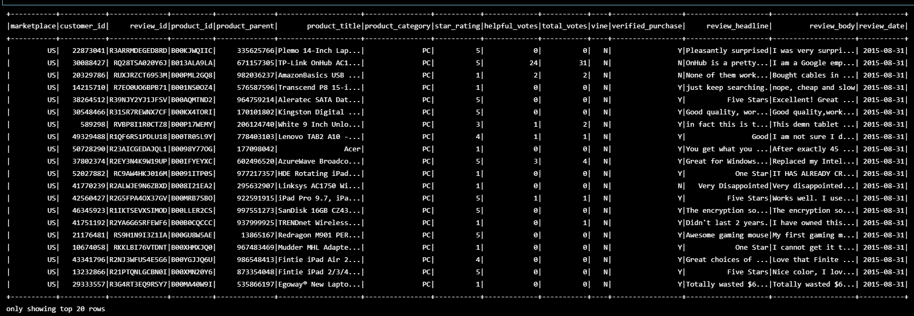
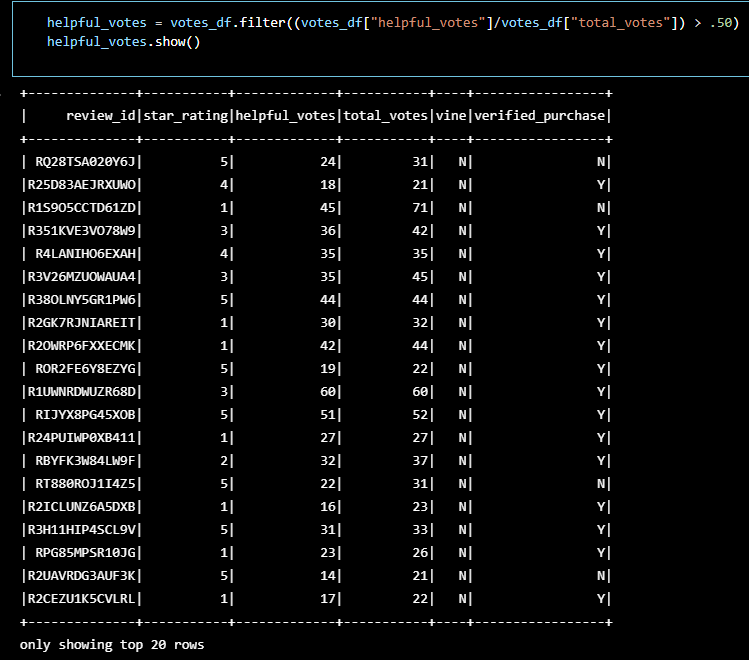
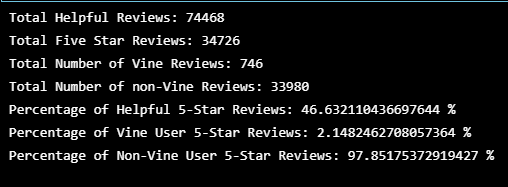
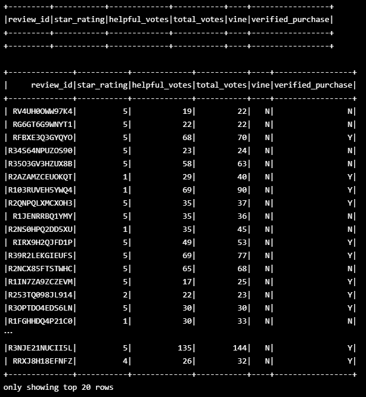
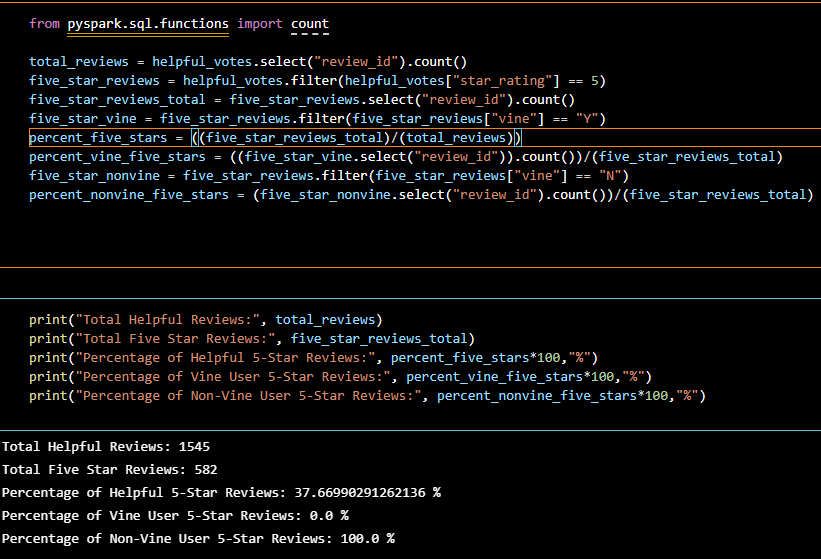

# An Analysis of Amazon Vine Program User Reviews

### *Files*:
- First Jupyter Notebook ETL File (Digital Video Games): [First_Amazon_Reviews_ETL](First_Amazon_Reviews_ETL.ipynb)
- First Review Analysis File (Digital Video Games): [First_Vine_Review_Analysis](First_Vine_Review_Analysis.ipynb)
- Second Jupyter Notebook ETL File (PC Products): [Second_Amazon_Reviews_ETL](Second_Amazon_Reviews_ETL.ipynb)
- Second Review Analysis File (PC Products): [Second_Vine_Review_Analysis](Second_Vine_Review_Analysis.ipynb)

## **Overview:**
Clients have sought insight from an in-depth analysis into large amounts of data related to sales reviews and trends in the types of reviews customers leave. Specifically, they are interested in how reviews from paid reviewers differ from those left by non-paid reviewers of different products on the website. By comparing the review data available from Amazon's records, comparing the reviews left by customers based on their involvement in the Vine program can provide valuable information in the level of satisfaction customers have based on their involvement with the company. This analysis can also show the presence of a bias in reviews by members of the Vine program and give an idea of how much of a bias might exist.

## **Results:**
The results from this analysis provided some clear answers to the question of how biased reviews for PC-related products were from Vine program members compared to those of non-Vine members that provided reviews that other customers found "helpful" according to their feedback on the listed reviews.

### *Results From Second Analysis*:
The initial dataset included a huge amount of data, as shown in the image of the created dataframe below. This included several columns that were not needed for the analysis and could fortunately be discarded.
- 

By analyzing the collection of reviews provided by Amazon, the list was narrowed down by multiple criteria to remove the reviews that could dilute the trends in the data or add general ambiguity to conclusions from the dataset. These criteria included: requiring more than 20 total votes on the review by other site users, narrowing that subsequent list by requiring more than 50% of user votes to consider the review "helpful", the resulting dataframe is provided in the image below.
- 

This dataframe was then split based on reviews provided by Vine members and non-Vine members. The calculated results included: how many Vine-affiliated and non-Vine-affiliated reviews were there, how many of those two groups were 5-star reviews, and what percentage of those 5-star reviews were from Vine-affiliated users and how many were from non-Vine-affiliated users. These conclusions are included in the summary image below.
- 

### *Results of the First Analysis*:
In addition to these conlcusions from this analysis, an unexpected conclusion came from the intial analysis conducted on product reviews for digital video games sold by Amazon. This analysis showed from over 1,500 highly-rated reviews by site users, none of them were from Vine members and none of the reviews in the dataset overall were from Vine members. As shown in the dataframes shown in the image below, the Vine-affiliated review dataframe is entirely empty.
- 

The concluding summary for this dataset showed that a spread in the 5-star reviews and lower-rated reviews existed but the percentages between Vine and non-Vine members was very clear on the lack of bias in this data.
- 

## **Summary:**
Based on these analyses, there doesn't seem to be any positivity bias in the Vine program for digital video games nor for PC-related products. This conclusion is based on the fact that the number of 5-star reviews from Vine-affiliated users are in a very small minority compared to the non-Vine users' reviews that provided 5-stars for the product. To further confirm this conclusion an analysis for 4-star reviews or 4 and 5-star reviews could be conducted to see if a trend exists when not focusing on the highest rated reviews. This might show a stronger trend of positive bias coming from Vine users, especially if the intention of providing bias is to make its presence less obvious. However, one other potential analysis that could show a bias among Vine users would be to count the reviews without the filtering based on user feedback voting for their helpfulness. If a bias does exist and it is more obvious, then one could theoretically conclude such reviews would be less helpful for potential buyers. Though, with the reviews for digital video games, the result would be the same no matter what filtering is done.
